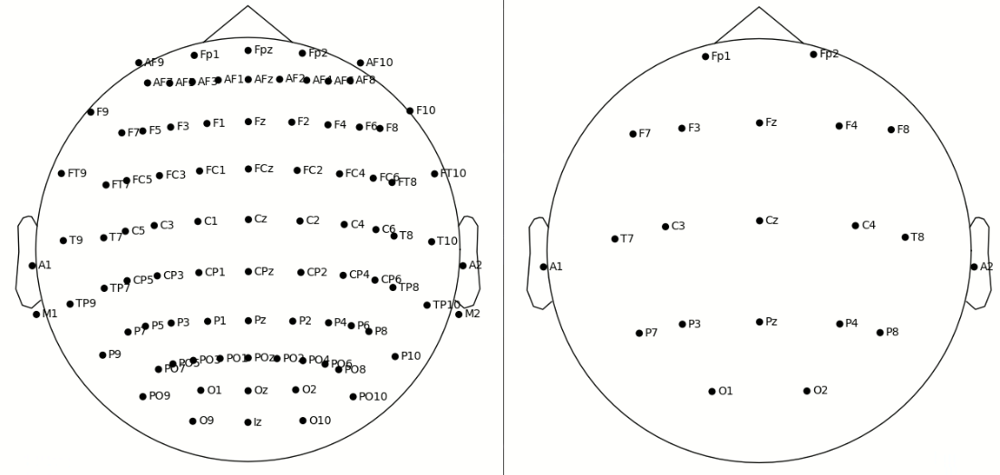

# EEG Analysis of Affective Music Experiences

Josiah Duhaime

---

## Table of Contents

* [Background](##Background)
* [Goals](##Goals)
* [Data](##Data)
* [Data Visualizations](##Data-Visualizations)
* [Statistics](##Statistics)
* [Next Steps](##Next-Steps)
* [References](References)

## Background

Electroencephalography (EEG) is a non-invasive means of measuring elctrical activity, e.g. excitatory postsynaptic potential and inhibitory postsynaptic potentials, on the scalp which represents the macro electrical activity of the cerebral cortex. More simply, EEGs measure depolarizations and hyperpolarizations across a brain region and between electrodes.

Each electrode used during an EEG has a particular naming convention. Here is a simplified version of the rules:

* Even electrodes are on the right
* Odd electrodes are on the left
* z is used to denote a mid sagittal electrode
* A letter code denotes the region of the brain
    * Pre-frontal: Fp
    * Frontal: F
    * Temporal: T
    * Parietal: P
    * Occipital: O
    * Central: C

There are several standards for collecting EEG data. One such is called the Standard 10-20. This montage can be expanded or restricted by adding or removing electrodes to allow for greater or lesser granularity.

---

## Goals

* Increase competency in exploratory data analysis
* Gain familiarity with EEG data
    * Potential future projects regarding brain computer interfaces

---

## Data

The [data](https://openneuro.org/datasets/ds002721/versions/1.0.0) obtained from the work of Nicoletta Nicolaou (creator), Ian Daly (creator), Slawomir Nasuto (principle investigator) and others which can be obtained through [brainlife](https://brainlife.io/).

There were 31 subjects (18 female, 13 male; mean age of 39.13 ± 14.48; age range 18-66) who were involved in this study to provide EEG data. Each subject conducted six EEGs, less subject 6 who was unable to perform the sixth EEG due to a non-disclosed reason. 

The first and sixth EEGs were used as controls while the second to fifth had interventions. The intervention was an exposure to the a selection of affective music. The music was obtained from the work of [Eerola and Vuoskoski](https://journals.sagepub.com/doi/10.1177/0305735610362821). During trials 2-5, the subject listened to 10, 20 second blocks of affective music and were asked varied questions regarding their emotional reaction to the music. 

* 31 Subjects
* 6 EEGs
* 300 - 600 secs
* Sampling rate: 1000 Hz
* 19 electrodes
* ~1,750,000,000 data points

The data was mainly in a European Data Format (EDF) which is a common file format for the exchange and storage of medical time series data. In addition, there was JavaScript Object Notation (JSON) and Comma-Separated Values (CSV) files that contained metadata and definitions of the codes used in the metadata.

---

## Data Visualization

Initially, each subjects' data was plotted to assess the quality and shape of the sensor data.

---

## Statistics

---

## Next Steps

* Analyze by the type of music
* Analyze by stated response to music
* Separate by Sex
* Normalize Data
* Explore Sentiment Analysis & Emotional Response to Music
* EDA of STD, Rate of Change, Skew, Cartesian Distance

---

## References

1. [Daly, I., Hallowell, J., Hwang, F., Kirke, A., Malik, A., Roesch, E., Weaver, J., Williams, D., Miranda, E., & Nasuto, S. (2014). Changes in music tempo entrain movement related brain activity. *2014 36th Annual International Conference of the IEEE Engineering in Medicine and Biology Society,* 4595-4598. doi: 10.1109/EMBC.2014.6944647](https://ieeexplore.ieee.org/document/6944647)
1. [Daly, I., Malik, A., Hwang, F., Roesch, E., Weaver, J., Kirke, A., Williams, D., Miranda, E., & Nasuto, S. (2014). Neural correlates of emotional responses to music: An EEG study. *Neuroscience Letters, 573*, 52-57. doi: 10.1016/j.neulet.2014.05.003](https://www.sciencedirect.com/science/article/abs/pii/S030439401400367X)
1. [Daly, Ian., Williams, D., Hallowell, J., Hwang, F., Kirke, A., Malike, A., Weaver, J,. Miranda, E., & Nasuto, S. (2015). Music-induced emotions can be predicted from a combination of brain activity and acoustic features. *Brain and Cognition, 101*, 1-11. doi: 10.1016/j.bandc.2015.08.003](https://www.sciencedirect.com/science/article/abs/pii/S0278262615300142)
1. [Daly, I., Nicolaou, N., Williams, D., Hwang, F., Kirke, A., Miranda, E., & Nasuto, S. (2020). Neural and physiological data from participants listening to afective music. *Scientific Data, 7*(177). doi: 10.6084/m9.figshare.12326519](https://www.nature.com/articles/s41597-020-0507-6)
